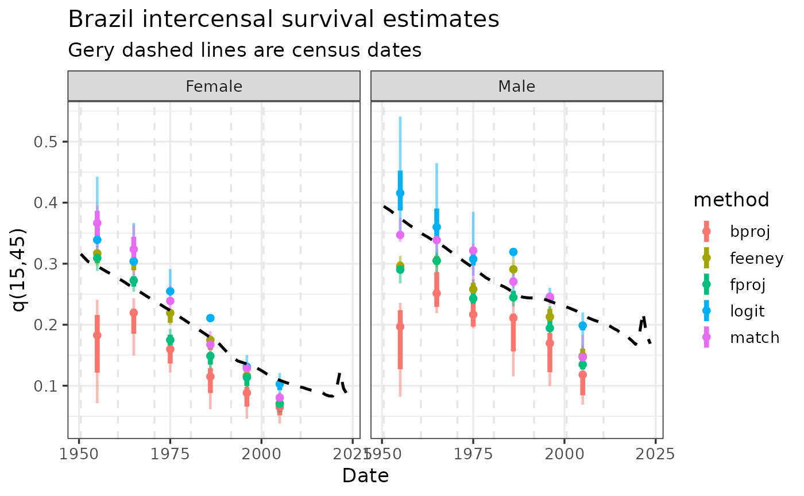

# Intercensal survival method for adult mortality: an application to Brazil

## Introduction

Intercensal survival methods are based on relating the size of cohorts
between two consecutive census dates, drawing on the population
balancing equation for closed populations (Hill 2001; Preston et al.
2001). The main source of information is the population distribution by
sex and age group from two successive censuses, generally conducted 5 or
10 years apart (Arriaga 1994; Hill 2001). These methods are essential
for producing estimates of adult mortality in contexts where vital
registration systems are nonexistent or have insufficient coverage (Hill
2001; Moultrie et al. 2013). They also serve as diagnostic tools for
assessing the consistency of demographic data and detecting anomalies in
the age structure of the population (Hill 2001; Moultrie et al. 2013).

The intercensal relationship between cohorts, assuming that the first
census was conducted at ($`t_1`$) and the second at ($`t_2`$), is:

``` math
{}_5S_x(t_1,t_2) = \frac{{}_5N_{x+(t_2-t_1)}(t_2)}
{{}_5N_x(t_1)}
```

The main methodological variants include:

- **Model-pattern fitting (*match*):** this method is based on selecting
  a model life table family and identifying the level that provides the
  best fit for each ($`{}_5S_x`$) corresponding to each age group. The
  indicators of interest are then obtained from the resulting life
  table—in our case, ($`{}_{45}q_{15}`$)—and a summary measure is
  calculated across all cohorts.

  This is considered the most rudimentary method and was originally
  recommended in *Manual X* (United Nations Population Division 1983). A
  later refinement presented by Preston (1983b) applies the Brass logit
  transformation, using the selected model family as the standard and
  the resulting level obtained from the fitting method as the reference
  (Preston et al. 2001).

- **Forward and backward projection (*fproj and bproj*):** these methods
  start from the first—or the last—census and use a model family to
  project the population forward—or backward—in order to determine the
  mortality level required to reproduce the age structure of the
  second—or first—census. The literature indicates that differences
  between the two approaches will always exist, regardless of the errors
  present. Nevertheless, “backward projections provide a less biased
  estimate of the correct mortality level, provided that there are no
  age-reporting errors and that enumeration completeness differs between
  the two censuses” (Palloni and Kominski 1984). In general, it is
  recommended that the method be applied in both directions and that a
  way of combining the results be sought, taking into account the
  particular characteristics of the population under study (United
  Nations Population Division 1983).

- **Variable-(r) (*var-r*):** the population by age and sex can be
  expressed as a function of survival ratios and cohort growth rates, a
  relationship derived by relaxing the stable-population assumption of a
  single growth rate originating from births (Bennett and Horiuchi
  1981). Given the size of each cohort at two different points in time
  and the average annual growth rate by age, it is possible to infer the
  implicit survival ratio for each age group (Preston and Bennett
  1983a). The main advantage of this method is that the width of the age
  groups does not need to coincide with the length of the intercensal
  period.

- **Feeney method (*feeney*):** the central idea of Feeney’s method
  (United Nations Population Division 2002) is to convert survival
  ratios into probabilities “rooted” at age 2.5. The procedure has
  different versions depending on the length of the intercensal
  interval—5 years, 10 years, or any other number of years.

The main limitation of these methods is their high sensitivity to
changes in census coverage completeness between one census and the next.
If the second census is more complete than the first, mortality will
appear artificially low (Hill 2001; Moultrie et al. 2013). In addition,
because the methods assume a closed population, unrecorded international
migration biases the estimated number of deaths (Hill 2001; Preston et
al. 2001). These situations produce cohort ratios greater than one,
which must be excluded as inputs to the methods, at least in those
methods that cannot be modified to incorporate migration. Finally, age
exaggeration among older adults and age misreporting generally produce
inconsistent or physically impossible survival ratios, such as values
greater than one (Hill 2001; Preston et al. 2001).

For step-by-step descriptions of the procedures, see Chapter XIV of
*Manual X* (United Nations Population Division 1983) or Chapter 9 of
Preston, Heuveline, and Guillot (2001).

## Input data

Data that we need (both loaded with the package):

- Census population by five age-groups and sex in consecutive census

``` r

library(dplyr)
#> 
#> Attaching package: 'dplyr'
#> The following objects are masked from 'package:stats':
#> 
#>     filter, lag
#> The following objects are masked from 'package:base':
#> 
#>     intersect, setdiff, setequal, union
library(tidyr)
library(ggplot2)
loc_name <- "Brazil"
census_data <- all_censuses |>
  filter(LocName == loc_name, SexName %in% c("Female", "Male")) |>
  arrange(SexName, TimeMid, AgeStart) |>
  select(LocName, IndicatorName, StatisticalConceptName, DataProcessType,
         TimeLabel, TimeMid, SexName, AgeStart, AgeSpan, DataValue)
```

- Life table information about infant/child mortality and $`e_0`$ (some
  methods requiere additional information)

``` r

head(lt5_wpp24_brazil, 2)
#>    SortOrder LocID  Notes ISO3_code ISO2_code SDMX_code LocTypeID  LocTypeName
#>        <int> <int> <char>    <char>    <char>     <int>     <int>       <char>
#> 1:       281    76              BRA        BR        76         4 Country/Area
#> 2:       281    76              BRA        BR        76         4 Country/Area
#>    ParentID Location VarID Variant  Time MidPeriod SexID    Sex AgeGrp
#>       <int>   <char> <int>  <char> <int>     <num> <int> <char> <char>
#> 1:      931   Brazil     2  Medium  1950    1950.5     1   Male      0
#> 2:      931   Brazil     2  Medium  1950    1950.5     1   Male    1-4
#>    AgeGrpStart AgeGrpSpan         mx         qx        px        lx        dx
#>          <int>      <int>      <num>      <num>     <num>     <num>     <num>
#> 1:           0          1 0.19185271 0.16911369 0.8308863 100000.00 16911.369
#> 2:           1          4 0.01895013 0.07230831 0.9276917  83088.63  6007.998
#>           Lx        Sx      Tx      ex       ax
#>        <num>     <num>   <num>   <num>    <num>
#> 1:  88147.67 0.8103805 4636940 46.3694 0.299150
#> 2: 317042.58 0.9409529 4548793 54.7463 1.451407
```

## Application

First we need to organize the pair-census comparison.

``` r

census_pairs <- tibble(
  date1 = head(sort(unique(census_data$TimeMid)), -1),
  date2 = tail(sort(unique(census_data$TimeMid)), -1)) |>
  mutate(t_middle = trunc((date1 + date2) / 2))
```

The for each one we will apply the different methods included in the
`intercensal_survival` function, with ages of fit for each one (deafult
based in literature, but can be also an additional combinatoric
variable) and all the eleven model life table families as pattern (see
[`DemoToolsData::modelLTx1`](https://rdrr.io/pkg/DemoToolsData/man/modelLTx1.html)).

``` r

# combination of possible methods and census pairs
grid <- crossing(
  census_pairs,
  sex_name = c("Female", "Male"),
  tibble(
    method = c("match", "bproj", "fproj", "var-r", "feeney", "logit"),
    li = c(15, 0, 0, 10, 5, 0),
    ui = c(60, 40, 40, 30, 30, 60)
  )
)
```

We loop over the combinations of sex/interval/method/mlt with `pmap`
from the `map` family functions (if we set `mlt_family = NULL` then
results for all the models are returned). If you want to see in detail
the application to some census pair (not looping in an industrial scale
as here) see the `intercensal_survival` documentation.

``` r

library(purrr)
runs <- pmap(grid, \(date1, date2, t_middle, sex_name, method, li, ui) {
  tryCatch({
    # get census data for the combination
    census_pair <- census_data |>
      filter(SexName == sex_name, TimeMid %in% c(date1, date2)) |>
      arrange(TimeMid, AgeStart)
    # get life table data for the combination
    lt_input <- lt5_wpp24_brazil |>
      filter(Sex == sex_name, Time == t_middle, AgeGrpStart %in% c(0, 1, 5)) |>
      arrange(AgeGrpStart)
    # apply methods
    out <- intercensal_survival(
      c1 = census_pair$DataValue[census_pair$TimeMid == date1],
      c2 = census_pair$DataValue[census_pair$TimeMid == date2],
      date1 = date1,
      date2 = date2,
      age1 = census_pair$AgeStart[census_pair$TimeMid == date1],
      age2 = census_pair$AgeStart[census_pair$TimeMid == date2],
      sex = if_else(sex_name == "Female", "f", "m"),
      mlt_family = NULL,
      method = method,
      ages_fit = seq(li, ui, 5),
      mlt_e0_logit_feeney = lt_input$ex[lt_input$AgeGrpStart == 0],
      q01_q05 = 1 - lt_input$lx[lt_input$AgeGrpStart %in% c(1, 5)] / 1e5,
      verbose = FALSE
    )
    # return
    list(
      result = out$selected_level |>
        left_join(out$Adult, by = "type") |>
        mutate(loc_name, sex_name, method, date1, date2, t_middle, .before = 1),
      error = NA_character_
    )
  }, error = \(e) list(result = NULL, error = conditionMessage(e)))
})
#> Warning in lt_rule_m_extrapolate(x = Age, mx = nMx, x_fit = extrapFit, x_extr = x_extr, : Extrapolation failed to converge
#> Falling back to Gompertz with starting parameters:
#>  parS = c(A = 0.005, B = 0.13))
```

## Results

First we can take a look to combinations that did not work, and if we
see something we need to loof for the reason (can exists quality
problems in census data, or some issue arrangin the data, etc.). In ths
case we are safe.

``` r

issues_df <- grid |>
  mutate(error = map_chr(runs, "error")) |>
  filter(!is.na(error))
head(issues_df, 2)
#> # A tibble: 2 × 8
#>   date1 date2 t_middle sex_name method    li    ui error                        
#>   <dbl> <dbl>    <dbl> <chr>    <chr>  <dbl> <dbl> <chr>                        
#> 1 1950. 1961.     1955 Female   var-r     10    30 [ was called on a data.table…
#> 2 1950. 1961.     1955 Male     var-r     10    30 [ was called on a data.table…
```

There are many ways to get summary information from the results. We
choose here to get min/max and inter-quartil percentiles for each sex,
method and census-pair.

``` r

results_df <- map2_dfr(runs, seq_len(nrow(grid)), \(x, i) {
  if (is.null(x$result)) return(NULL)
  x$result |> mutate(run_id = i, .before = 1)
})
dispersion_df <- results_df |>
  summarise(
    q15_45_min = min(q15_45, na.rm = TRUE),
    q15_45_p25 = quantile(q15_45, 0.25, na.rm = TRUE),
    q15_45_med = median(q15_45, na.rm = TRUE),
    q15_45_p75 = quantile(q15_45, 0.75, na.rm = TRUE),
    q15_45_max = max(q15_45, na.rm = TRUE),
    .by = c(sex_name, method, t_middle)
  )
```

We plot the results agaist WPP24 results (which in some way already is
considering the estimates). The `match` method yields higher adult
mortality in all periods and for both sexes, while `fproj` looks always
too lower, and the estimates produced by the other four methods are
fairly similar. If the estimates from WPP 2024 are incorporated into the
analysis, the mortality level estimated for 2000–2010 appears to be too
low. Besides that, looks intercensal estimates can inform about general
tendency between 1950-2010. Comparison with other estimates, regions, or
countries is therefore particularly useful for calibrating the final
adjustment.

``` r

wpp_q15_45_df <- lt5_wpp24_brazil |>
  summarise(q15_45_wpp = 1 - lx[AgeGrpStart == 60] / lx[AgeGrpStart == 15],
            .by = c(Sex, Time))
ggplot(dispersion_df, aes(t_middle, q15_45_med, color = method)) +
  geom_linerange(aes(ymin = q15_45_min, ymax = q15_45_max), alpha = 0.5, linewidth = 0.8) +
  geom_linerange(aes(ymin = q15_45_p25, ymax = q15_45_p75), linewidth = 1.5) +
  geom_vline(xintercept = unique(census_data$TimeMid), col = "grey90", linetype = 2) +
  geom_point(size = 1.8) +
  geom_line(
    data = wpp_q15_45_df |> mutate(t_middle = Time + .5, sex_name = Sex),
    aes(x = t_middle, y = q15_45_wpp),
    color = "black",
    linewidth = 0.9,
    linetype = "dashed") +
  facet_wrap(~ sex_name) +
  labs(x = "Date", y = "q(15,45)", title = "Brazil intercensal survival estimates", subtitle = "Gery dashed lines are census dates") +
  theme_bw(base_size = 13) +
  theme(panel.grid.minor.x = element_blank())
```



## References

Arriaga, Eduardo E. 1994. *Population Analysis with Microcomputers.
Volume i: Presentation of Techniques*. United States Bureau of the
Census.

Bennett, Neil G., and Shiro Horiuchi. 1981. “Estimating the Completeness
of Death Registration in a Closed Population.” *Population Index* 47
(2): 207–21. <https://doi.org/10.2307/2736447>.

Hill, Kenneth. 2001. *Methods for Measuring Adult Mortality in
Developing Countries: A Comparative Review*. International Union for the
Scientific Study of Population.

Moultrie, Tom A., Rob E. Dorrington, Allan G. Hill, Kenneth Hill, Ian M.
Timæus, and Basia Zaba, eds. 2013. *Tools for Demographic Estimation*.
International Union for the Scientific Study of Population.
<https://demographicestimation.iussp.org/>.

Palloni, Alberto, and Robert Kominski. 1984. *Estimating Adult Mortality
with Forward and Backward Projections*. United Nations.

Preston, Samuel H., and Neil G. Bennett. 1983b. “A Census-Based Method
for Estimating Adult Mortality.” *Population Studies* 37 (1): 91–104.
<https://doi.org/10.1080/00324728.1983.10405926>.

Preston, Samuel H., and Neil G. Bennett. 1983a. “A Census-Based Method
for Estimating Adult Mortality.” *Population Studies* 37 (1): 91–104.
<https://doi.org/10.1080/00324728.1983.10405926>.

Preston, Samuel H., Patrick Heuveline, and Michel Guillot. 2001.
*Demography: Measuring and Modeling Population Processes*. Blackwell.

United Nations Population Division. 1983. *Manual x: Indirect Techniques
for Demographic Estimation*. Population Studies 81. Department of
International Economic; Social Affairs; United Nations.
<https://www.un.org/development/desa/pd/sites/www.un.org.development.desa.pd/files/files/documents/2020/Jan/un_1983_manual_x_-_indirect_techniques_for_demographic_estimation.pdf>.

United Nations Population Division. 2002. *Methods for Estimating Adult
Mortality*. ESA/P/WP.175. Department of Economic; Social Affairs; United
Nations.
<https://www.un.org/development/desa/pd/sites/www.un.org.development.desa.pd/files/files/documents/2020/Jan/un_2002_methodsestimatingadultmort.pdf>.
