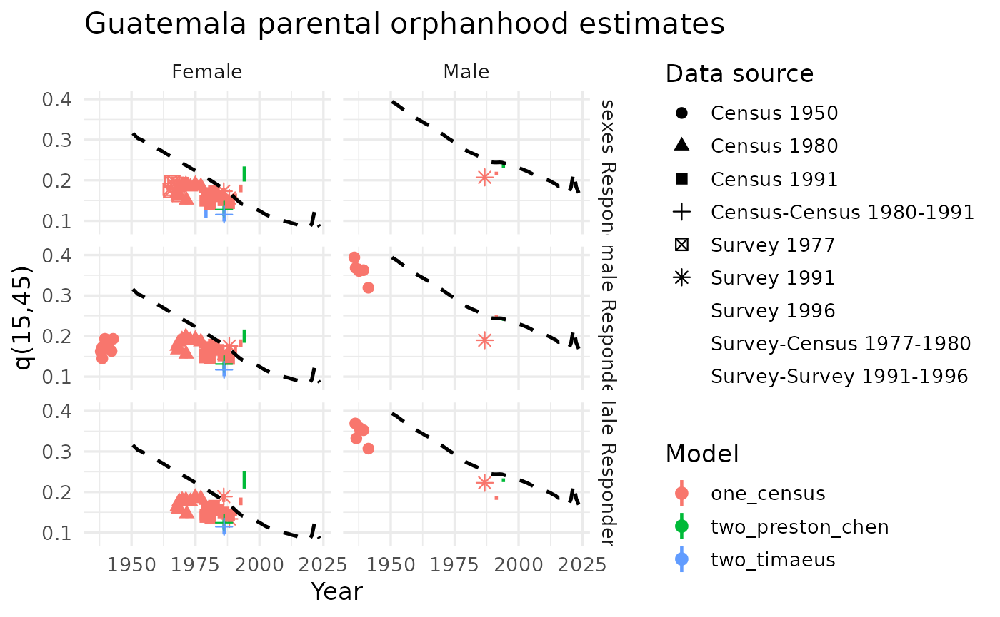

# Orphanhood method for adult mortality: an application to Brazil

## Introduction

Orphanhood information is commonly collected in censuses and surveys
through questions such as whether a person’s biological mother or father
is still alive. Questions about mothers are more frequent than questions
about fathers. In censuses, they are usually asked across all age
groups, whereas surveys such as the DHS often restrict them to the
youngest age groups. These data have been widely used in countries with
incomplete vital statistics. IPUMS standardized orphanhood variables and
made harmonized modules and questionnaire images available (IPUMS 2026),
while the DHS program provides access to survey data and documentation.

The underlying demographic logic is that the parental survival status
reported by children contains information on adult mortality. If all
mothers gave birth at age 25, a respondent aged (n) would provide direct
information on ({}*nq*{25}). In reality, fertility is distributed across
ages, so the age pattern of childbearing must be taken into account.
Timæus (1992) therefore modeled adult survival using the proportion of
respondents with a surviving mother or father, ({}*5S*{n-5}), together
with the mean age of childbearing.

For women, the method estimates survival for (n) years from age 25 using

``` math
{}_np_{25}
a(n)+b(n),\text{MAC}+c(n),{}_5S_{n-5},
```

where the coefficients vary by five-year respondent age group. For
fathers, the corresponding equation begins at age 35 and uses a
different set of coefficients. The coefficients were derived from
simulated combinations of Brass relational mortality models and Booth’s
relational Gompertz fertility model (Booth 1984). Thus, the method can
be applied under a range of mortality and fertility regimes rather than
under a single fixed demographic pattern.

For example, if 80% of women aged 20–24 report that their mother is
still alive and the mean age of childbearing is 27, the coefficients for
ages 25–29 can be used to obtain

``` math
{}_{25}p_{25}
-0.1808+0.00586\times27+1.0267\times0.8
0.79878.
```

This implies a probability of dying over the previous 25 years of
approximately 20%, under the assumption that fertility and mortality
remained constant over that period. The coefficient attached to mean age
of childbearing is positive because, for a given proportion with a
surviving parent, later childbearing implies that parents are younger
and therefore more likely to be alive (Preston et al. 2001).

The method also locates each estimate at a specific reference date
rather than automatically assigning it to the midpoint of the exposure
interval. The resulting time lag depends on respondent age, the
fertility pattern, and the age schedule of mortality. Older respondents
provide information on older parents who have been exposed to mortality
risks for longer periods. Since each respondent age group yields a
separate estimate of ({}*np*{25}), inconsistencies may arise across
ages. Each estimate should therefore be mapped onto a standard mortality
pattern, evaluated, and retained only when it provides demographically
plausible information (United Nations Population Division 1983).

The main limitations include the adoption effect (Timæus 1991), age
misreporting, uncertainty about parental identity or survival status,
and the greater weight assigned to high-fertility adults because they
have more children available to respond. HIV/AIDS can also cause
underestimation because infected women tend to have lower fertility and
infected children may die before the survey; Timæus and Nunn (1997)
proposed a correction based on HIV prevalence, reduced fertility, and
vertical transmission. When two observations are available, cohort
changes in orphanhood can be used to estimate parental survival more
directly. For example,

``` math
{}_{10}p_{49.5}
\frac{{}_{32.5}p_{27}}{{}_{22.5}p_{27}}
\frac{0.6}{0.8}
0.75.
```

These two-survey approaches use variable-(r) adjustments, usually refer
estimates to the midpoint between observations, and retain
cohort-specific estimates separately in order to assess statistical
uncertainty (Timæus 1991; Preston et al. 2001; Moultrie et al. 2013;
Preston and Chen 1984). Although we do not apply it here, you can find
an adaptation of the Macura (1984) method in the `orphanhood_macura`
function.

## Input data

Data that we need (both loaded with the package) are

- `Orphanhood_DB_full`: census and survey information about survival
  parents by age and sex of respondants.

``` r

head(Orphanhood_DB)
#>                                                               IndicatorName
#>                                                                      <char>
#> 1: Proportion of the population with mother alive by age and sex - abridged
#> 2: Proportion of the population with mother alive by age and sex - abridged
#> 3: Proportion of the population with mother alive by age and sex - abridged
#> 4: Proportion of the population with mother alive by age and sex - abridged
#> 5: Proportion of the population with mother alive by age and sex - abridged
#> 6: Proportion of the population with mother alive by age and sex - abridged
#>    IndicatorID     LocName LocID StructuredDataID LocTypeName LocTypeID RegName
#>          <num>      <char> <num>            <num>      <char>     <num>   <num>
#> 1:         101 Afghanistan     4        382635629     Country         5      NA
#> 2:         101 Afghanistan     4        382635630     Country         5      NA
#> 3:         101 Afghanistan     4        382635631     Country         5      NA
#> 4:         101 Afghanistan     4        382635632     Country         5      NA
#> 5:         101 Afghanistan     4        382635633     Country         5      NA
#> 6:         101 Afghanistan     4        382635634     Country         5      NA
#>    RegID AreaName AreaID LocAreaTypeName LocAreaTypeID
#>    <num>    <num>  <num>          <char>         <num>
#> 1:     0       NA      0      Whole area             2
#> 2:     0       NA      0      Whole area             2
#> 3:     0       NA      0      Whole area             2
#> 4:     0       NA      0      Whole area             2
#> 5:     0       NA      0      Whole area             2
#> 6:     0       NA      0      Whole area             2
#>                    SubGroupTypeName SubGroupTypeID SubGroupID1
#>                              <char>          <num>       <num>
#> 1: Total / All groups / Whole group              2           2
#> 2: Total / All groups / Whole group              2           2
#> 3: Total / All groups / Whole group              2           2
#> 4: Total / All groups / Whole group              2           2
#> 5: Total / All groups / Whole group              2           2
#> 6: Total / All groups / Whole group              2           2
#>           SubGroupName SubGroupCombinationID SubGroupTypeSortOrder
#>                 <char>                 <num>                 <num>
#> 1: Total or All groups                     0                     3
#> 2: Total or All groups                     0                     3
#> 3: Total or All groups                     0                     3
#> 4: Total or All groups                     0                     3
#> 5: Total or All groups                     0                     3
#> 6: Total or All groups                     0                     3
#>    IndicatorShortName DataCatalogID DataProcessTypeID DataProcessType
#>                <char>         <num>            <char>          <char>
#> 1:       pMotherAlive          5045            Survey          Survey
#> 2:       pMotherAlive          5045            Survey          Survey
#> 3:       pMotherAlive          5045            Survey          Survey
#> 4:       pMotherAlive          5045            Survey          Survey
#> 5:       pMotherAlive          5045            Survey          Survey
#> 6:       pMotherAlive          5045            Survey          Survey
#>    DataProcessTypeSort DataProcess DataProcessID DataProcessSort
#>                  <num>      <char>         <num>           <num>
#> 1:                   3      DHS-NS            48              16
#> 2:                   3      DHS-NS            48              16
#> 3:                   3      DHS-NS            48              16
#> 4:                   3      DHS-NS            48              16
#> 5:                   3      DHS-NS            48              16
#> 6:                   3      DHS-NS            48              16
#>                      DataCatalogName DataCatalogShortName ReferencePeriod
#>                               <char>               <char>          <char>
#> 1: Afghanistan 2010 Mortality Survey     2010 DHS Special            2010
#> 2: Afghanistan 2010 Mortality Survey     2010 DHS Special            2010
#> 3: Afghanistan 2010 Mortality Survey     2010 DHS Special            2010
#> 4: Afghanistan 2010 Mortality Survey     2010 DHS Special            2010
#> 5: Afghanistan 2010 Mortality Survey     2010 DHS Special            2010
#> 6: Afghanistan 2010 Mortality Survey     2010 DHS Special            2010
#>    ReferenceYearStart ReferenceYearEnd ReferenceYearMid       FieldWorkStart
#>                 <num>            <num>            <num>               <char>
#> 1:               2010             2010           2010.5 4/1/2010 12:00:00 AM
#> 2:               2010             2010           2010.5 4/1/2010 12:00:00 AM
#> 3:               2010             2010           2010.5 4/1/2010 12:00:00 AM
#> 4:               2010             2010           2010.5 4/1/2010 12:00:00 AM
#> 5:               2010             2010           2010.5 4/1/2010 12:00:00 AM
#> 6:               2010             2010           2010.5 4/1/2010 12:00:00 AM
#>              FieldWorkEnd FieldWorkMiddle DataCatalogNote DataSourceID
#>                    <char>           <num>          <char>        <num>
#> 1: 12/31/2010 12:00:00 AM         2010.62                        44606
#> 2: 12/31/2010 12:00:00 AM         2010.62                        44606
#> 3: 12/31/2010 12:00:00 AM         2010.62                        44606
#> 4: 12/31/2010 12:00:00 AM         2010.62                        44606
#> 5: 12/31/2010 12:00:00 AM         2010.62                        44606
#> 6: 12/31/2010 12:00:00 AM         2010.62                        44606
#>                                                                                                                                                 DataSourceAuthor
#>                                                                                                                                                           <char>
#> 1: Afghan Public Health Institute, Central Statistics Organization , ICF Macro , Indian Institute of Health Management Research , World Health Organization/EMRO
#> 2: Afghan Public Health Institute, Central Statistics Organization , ICF Macro , Indian Institute of Health Management Research , World Health Organization/EMRO
#> 3: Afghan Public Health Institute, Central Statistics Organization , ICF Macro , Indian Institute of Health Management Research , World Health Organization/EMRO
#> 4: Afghan Public Health Institute, Central Statistics Organization , ICF Macro , Indian Institute of Health Management Research , World Health Organization/EMRO
#> 5: Afghan Public Health Institute, Central Statistics Organization , ICF Macro , Indian Institute of Health Management Research , World Health Organization/EMRO
#> 6: Afghan Public Health Institute, Central Statistics Organization , ICF Macro , Indian Institute of Health Management Research , World Health Organization/EMRO
#>    DataSourceYear                    DataSourceName
#>             <num>                            <char>
#> 1:           2010 Afghanistan Mortality Survey 2010
#> 2:           2010 Afghanistan Mortality Survey 2010
#> 3:           2010 Afghanistan Mortality Survey 2010
#> 4:           2010 Afghanistan Mortality Survey 2010
#> 5:           2010 Afghanistan Mortality Survey 2010
#> 6:           2010 Afghanistan Mortality Survey 2010
#>                  DataSourceShortName DataSourceSort DataStatusName DataStatusID
#>                               <char>          <num>         <char>        <num>
#> 1: Afghanistan Mortality Survey 2010              0          Final            1
#> 2: Afghanistan Mortality Survey 2010              0          Final            1
#> 3: Afghanistan Mortality Survey 2010              0          Final            1
#> 4: Afghanistan Mortality Survey 2010              0          Final            1
#> 5: Afghanistan Mortality Survey 2010              0          Final            1
#> 6: Afghanistan Mortality Survey 2010              0          Final            1
#>    DataStatusSort StatisticalConceptName StatisticalConceptID
#>             <num>                 <char>                <num>
#> 1:              2               De-facto                    2
#> 2:              2               De-facto                    2
#> 3:              2               De-facto                    2
#> 4:              2               De-facto                    2
#> 5:              2               De-facto                    2
#> 6:              2               De-facto                    2
#>    StatisticalConceptSort    SexName SexID SexSort AgeID AgeUnit AgeStart
#>                     <num>     <char> <num>   <num> <num>  <char>    <num>
#> 1:                      1 Both sexes     3       3   702    Year        5
#> 2:                      1 Both sexes     3       3   703    Year       10
#> 3:                      1 Both sexes     3       3   704    Year       15
#> 4:                      1 Both sexes     3       3   705    Year       20
#> 5:                      1 Both sexes     3       3   706    Year       25
#> 6:                      1 Both sexes     3       3   707    Year       30
#>    AgeEnd AgeSpan AgeMid AgeLabel AgeSort agesort DataTypeGroupName
#>     <num>   <num>  <num>   <char>   <num>   <num>            <char>
#> 1:     10       5    7.5      5-9      69       0            Direct
#> 2:     15       5   12.5    10-14     133       0            Direct
#> 3:     20       5   17.5    15-19     190       0            Direct
#> 4:     25       5   22.5    20-24     263       0            Direct
#> 5:     30       5   27.5    25-29     306       0            Direct
#> 6:     35       5   32.5    30-34     330       0            Direct
#>    DataTypeGroupID DataTypeName DataTypeID DataTypeSort      ModelType
#>              <num>       <char>      <num>        <num>         <char>
#> 1:               3       Direct         16           11 Not applicable
#> 2:               3       Direct         16           11 Not applicable
#> 3:               3       Direct         16           11 Not applicable
#> 4:               3       Direct         16           11 Not applicable
#> 5:               3       Direct         16           11 Not applicable
#> 6:               3       Direct         16           11 Not applicable
#>    ModelPatternFamilyName ModelPatternFamilyID        ModelPatternName
#>                    <char>                <num>                  <char>
#> 1:         Not applicable                   15 Not applicable (Direct)
#> 2:         Not applicable                   15 Not applicable (Direct)
#> 3:         Not applicable                   15 Not applicable (Direct)
#> 4:         Not applicable                   15 Not applicable (Direct)
#> 5:         Not applicable                   15 Not applicable (Direct)
#> 6:         Not applicable                   15 Not applicable (Direct)
#>    ModelPatternID DataReliabilityName DataReliabilityID DataReliabilitySort
#>             <num>              <char>             <num>               <num>
#> 1:             40                Fair                 5                   2
#> 2:             40                Fair                 5                   2
#> 3:             40                Fair                 5                   2
#> 4:             40                Fair                 5                   2
#> 5:             40                Fair                 5                   2
#> 6:             40                Fair                 5                   2
#>    PeriodTypeName PeriodTypeID PeriodGroupName PeriodGroupID PeriodStart
#>            <char>        <num>          <char>         <num>       <num>
#> 1:             RP            6               0           433           0
#> 2:             RP            6               0           433           0
#> 3:             RP            6               0           433           0
#> 4:             RP            6               0           433           0
#> 5:             RP            6               0           433           0
#> 6:             RP            6               0           433           0
#>    PeriodEnd PeriodSpan PeriodMiddle Weight TimeUnit  TimeStart    TimeEnd
#>        <num>      <num>        <num>  <num>   <char>     <char>     <char>
#> 1:         0          0            0     NA     year 15/08/2010 15/08/2010
#> 2:         0          0            0     NA     year 15/08/2010 15/08/2010
#> 3:         0          0            0     NA     year 15/08/2010 15/08/2010
#> 4:         0          0            0     NA     year 15/08/2010 15/08/2010
#> 5:         0          0            0     NA     year 15/08/2010 15/08/2010
#> 6:         0          0            0     NA     year 15/08/2010 15/08/2010
#>    TimeDuration  TimeMid TimeLabel FootNoteID    id         SeriesID DataValue
#>           <num>    <num>    <char>      <num> <num>           <char>     <num>
#> 1:            0 2010.619      2010          0     1 1041324512495107 0.9867798
#> 2:            0 2010.619      2010          0     1 1041324512495107 0.9712740
#> 3:            0 2010.619      2010          0     1 1041324512495107 0.9490994
#> 4:            0 2010.619      2010          0     1 1041324512495107 0.9216962
#> 5:            0 2010.619      2010          0     1 1041324512495107 0.8639209
#> 6:            0 2010.619      2010          0     1 1041324512495107 0.7899554
```

- `mac_wpp22`: mean age of childbearing from an external source, in this
  case from WPP 2022 revision. Consider here that onet hing is the mean
  age at risk of childearing (calculated from asfr) and other thing is
  the population weighted, taht only considers observed mothers and
  fathers. In general those looks similar in value.

``` r

head(mac_wpp22)
#> # A tibble: 6 × 4
#>   LocID  Year parent   mac
#>   <int> <int> <chr>  <dbl>
#> 1     4  1950 mother  29.6
#> 2     4  1950 father  36.6
#> 3     4  1951 mother  29.6
#> 4     4  1951 father  36.6
#> 5     4  1952 mother  29.6
#> 6     4  1952 father  36.6
```

We join both data sources in one just for convenience, and select only
relevant variables, avoiding duplicate survey rows. Our main type of
indicator is “Proportion of the population with *mother* alive” and
“Proportion of the population with *father* alive” (are filtered by ID
in `DemoData` format), mening proportion not orphaned.

``` r

library(dplyr)
#> 
#> Attaching package: 'dplyr'
#> The following objects are masked from 'package:stats':
#> 
#>     filter, lag
#> The following objects are masked from 'package:base':
#> 
#>     intersect, setdiff, setequal, union
library(tidyr)
library(stringr)
library(ggplot2)
orp_data <- Orphanhood_DB |>
  filter(
    LocName == "Brazil",
    LocAreaTypeID == 2,
    AgeLabel != "Total",
    IndicatorID %in% c(101, 102),
    AgeEnd >= 0,
    DataValue > 0) |>
  mutate(
    parent = if_else(str_detect(IndicatorName, "mother"), "mother", "father"),
    Year = trunc(TimeMid),
    age = AgeStart,
    sex_resp = SexName,
    prop_not_orphan = DataValue
  ) |>
  select(LocID, LocName, DataSourceShortName, DataProcessType, IndicatorName,
         TimeLabel, TimeMid, Year, sex_resp, parent, age, prop_not_orphan) |>
  distinct() |>
  left_join(mac_wpp22, by = c("LocID", "Year", "parent"))
```

## Application

First we need to organize the one and pair-census comparison. FOr the
cas of two observations, there is a version of coefficients, one from
Ttimaeus and other from Perton & Chen. As in `intercensal_survvial`,
when `mlt_family = NULL` all the eleven model life table families are
considered as pattern (see
[`DemoToolsData::modelLTx1`](https://rdrr.io/pkg/DemoToolsData/man/modelLTx1.html)).

``` r

one_grid <- orp_data |>
  count(TimeMid, parent, sex_resp, name = "n_age")

two_grid <- one_grid |>
  arrange(parent, sex_resp, TimeMid) |>
  group_by(parent, sex_resp) |>
  mutate(date2 = lead(TimeMid)) |>
  transmute(date1 = TimeMid, date2, sex_resp) |>
  filter(!is.na(date2), trunc(date1) != trunc(date2), date2 - date1 < 30) |>
  crossing(variant = c("two_timaeus", "two_preston_chen"))
```

We loop over the combinations of sex/one-two/interval/coefficients/mlt
with `pmap` from the `map` family functions. If you want to see in
detail the application to some census pair (not looping in an industrial
scale as here) see the `orphanhood` documentation.

``` r

library(purrr)
# one observation method
one_runs <- pmap(one_grid, \(TimeMid, parent, sex_resp, n_age) {
  tryCatch({
    x <- orp_data |>
      filter(parent == .env$parent, TimeMid == .env$TimeMid, sex_resp == .env$sex_resp) |>
      arrange(age)
    out <- orphanhood_one(
      prop_not_orphan = x$prop_not_orphan,
      age = x$age,
      maternal = (parent == "mother"),
      mac = x$mac[1],
      date = x$TimeMid[1],
      mlt_family = NULL,
      verbose = FALSE
    )
    list(
      result = out$adult_mort_index |>
        mutate(
          variant = "one_census",
          source = x$DataProcessType[1],
          Year = x$TimeLabel[1],
          date1 = x$TimeMid[1],
          date2 = x$TimeMid[1],
          parent = parent,
          sex_resp = sex_resp,
          .before = 1
        ),
      error = NA_character_
    )
  }, error = \(e) list(result = NULL, error = conditionMessage(e)))
})
# two observations method
two_runs <- pmap(two_grid, \(parent, date1, date2, sex_resp, variant) {
  tryCatch({
    x <- orp_data |>
      filter(TimeMid %in% c(date1, date2), sex_resp == .env$sex_resp, parent == .env$parent) |>
      arrange(TimeMid, age)
    args <- list(
      prop1_not_orphan = x$prop_not_orphan[x$TimeMid == date1],
      prop2_not_orphan = x$prop_not_orphan[x$TimeMid == date2],
      age1 = x$age[x$TimeMid == date1],
      age2 = x$age[x$TimeMid == date2],
      date1 = date1,
      date2 = date2,
      maternal = (parent == "mother"),
      mac1 = x$mac[x$TimeMid == date1][1],
      mac2 = x$mac[x$TimeMid == date2][1],
      mlt_family = NULL,
      verbose = FALSE
    )
    if (variant == "two_preston_chen") args$method <- "preston_chen"
    out <- do.call(orphanhood_two, args)
    list(
      result = out$adult_mort_index |>
        mutate(
          source = paste0(x$DataProcessType[x$TimeMid == date1][1], "-",
                          x$DataProcessType[x$TimeMid == date2][1]),
          Year = paste0(x$TimeLabel[x$TimeMid == date1][1], "-",
                        x$TimeLabel[x$TimeMid == date2][1]),
          variant = variant,
          date1 = date1,
          date2 = date2,
          parent = parent,
          sex_resp = sex_resp,
          time_location = (date1 + date2) / 2,
          .before = 1
        ),
      error = NA_character_
    )
  }, error = \(e) list(result = NULL, error = conditionMessage(e)))
})
#> Joining with `by = join_by(age_yplus_n)`
#> Joining with `by = join_by(age_yplus_n)`
#> Joining with `by = join_by(age_yplus_n)`
#> Joining with `by = join_by(age_yplus_n)`
# bind results from the two methods
results_df <- bind_rows(
  map2_dfr(one_runs, seq_len(nrow(one_grid)), \(x, i) {
    if (is.null(x$result)) return(NULL)
    x$result |> mutate(run_id = paste0("one_", i), .before = 1)
  }),
  map2_dfr(two_runs, seq_len(nrow(two_grid)), \(x, i) {
    if (is.null(x$result)) return(NULL)
    x$result |> mutate(run_id = paste0("two_", i), .before = 1)
  })
)
```

## Results

First we can take a look to combinations that did not work, and if we
see something we need to loof for the reason (can exists quality
problems in census data, or some issue arrangin the data, etc.). In this
case we see an error realted to the age requirements of the Timaeus
coefficients in the two observation method.

``` r

issues_df <- bind_rows(
  one_grid |> mutate(error = map_chr(one_runs, "error"), variant = "one_census"),
  two_grid |> mutate(error = map_chr(two_runs, "error"))
) |>
  filter(!is.na(error))
head(issues_df)
#>    TimeMid parent   sex_resp n_age
#>      <num> <char>     <char> <int>
#> 1:      NA father Both sexes    NA
#> 2:      NA father     Female    NA
#> 3:      NA father       Male    NA
#> 4:      NA mother Both sexes    NA
#> 5:      NA mother     Female    NA
#> 6:      NA mother       Male    NA
#>                                                                         error
#>                                                                        <char>
#> 1: For applying this method you need adult ages for respondants (IUSSP, 2012)
#> 2: For applying this method you need adult ages for respondants (IUSSP, 2012)
#> 3: For applying this method you need adult ages for respondants (IUSSP, 2012)
#> 4: For applying this method you need adult ages for respondants (IUSSP, 2012)
#> 5: For applying this method you need adult ages for respondants (IUSSP, 2012)
#> 6: For applying this method you need adult ages for respondants (IUSSP, 2012)
#>        variant    date1    date2
#>         <char>    <num>    <num>
#> 1: two_timaeus 1991.791 1996.331
#> 2: two_timaeus 1991.791 1996.331
#> 3: two_timaeus 1991.791 1996.331
#> 4: two_timaeus 1991.791 1996.331
#> 5: two_timaeus 1991.791 1996.331
#> 6: two_timaeus 1991.791 1996.331
```

There are many ways to get summary information from the results. We
choose here to get min/max and inter-quartil percentiles for each sex,
method and census-pair.

``` r

dispersion_df <- results_df %>%
  mutate(name = ifelse(variant == "one_census",
                        paste0(source, " ", Year),
                        paste0(source, " ", trunc(date1), "-", trunc(date2))),
         time_point = round(time_location, 2)) |>
  summarise(
    q15_45_min = min(q15_45, na.rm = TRUE),
    q15_45_p25 = quantile(q15_45, 0.25, na.rm = TRUE),
    q15_45_med = median(q15_45, na.rm = TRUE),
    q15_45_p75 = quantile(q15_45, 0.75, na.rm = TRUE),
    q15_45_max = max(q15_45, na.rm = TRUE),
    .by = c(parent, sex_resp, source, variant, name, time_point)
  )
```

We plot the results agaist WPP24 results (which in some way already is
considering the estimates).

The various data sources available for Brazil make it possible to apply
the different methods discussed above, distinguishing both the sex of
the parent and the sex of the respondent. As expected, fewer
observations are available for fathers, a common limitation noted
previously. Estimates based on the 1950 Census appear to underestimate
the mortality level by around 50% and yield values similar to those
observed several decades later; these estimates should therefore
probably be discarded. Estimates based on a single observation show, for
women, a declining trend and a slightly lower mortality level than WPP
2024 (United Nations, Department of Economic and Social Affairs,
Population Division 2024), with a larger bias when the respondents are
men. Estimates based on two observations do not appear to improve
performance for women. For men, however, they seem to provide one
potentially useful estimate based on the 1991–1996 surveys.

``` r

wpp_q15_45_df <- lt5_wpp24_brazil |>
  filter(Sex %in% c("Female", "Male")) |>
  summarise(q15_45_wpp = 1 - lx[AgeGrpStart == 60] / lx[AgeGrpStart == 15],
            .by = c(Sex, Time))

ggplot(
  dispersion_df |>
    mutate(Sex = ifelse(parent == "mother", "Female", "Male"),
           sex_resp = paste0(sex_resp, " Respondent")),
  aes(time_point, q15_45_med, color = variant)
) +
  geom_linerange(aes(ymin = q15_45_p25, ymax = q15_45_p75), linewidth = 0.8) +
  geom_point(size = 2.5, aes(shape = name)) +
  geom_line(
    data = wpp_q15_45_df |> mutate(time_point = Time + .5),
    aes(x = time_point, y = q15_45_wpp),
    color = "black",
    linewidth = 0.9,
    linetype = "dashed"
  ) +
  facet_grid(cols = vars(Sex), rows = vars(sex_resp)) +
  labs(
    col = "Model",
    x = "Year",
    y = "q(15,45)",
    shape = "Data source",
    title = "Guatemala parental orphanhood estimates"
  ) +
  theme_minimal(base_size = 13)
#> Warning: The shape palette can deal with a maximum of 6 discrete values because more
#> than 6 becomes difficult to discriminate
#> ℹ you have requested 9 values. Consider specifying shapes manually if you need
#>   that many of them.
#> Warning: Removed 17 rows containing missing values or values outside the scale range
#> (`geom_point()`).
```



## References

Booth, Heather. 1984. “Transforming Gompertz’s Function for Fertility
Analysis: The Development of a Standard for the Relational Gompertz
Function.” *Population Studies* 38 (3): 495–506.
<https://doi.org/10.1080/00324728.1984.10410306>.

IPUMS. 2026. *IPUMS International: Harmonized International Census
Data*. Institute for Social Research; Data Innovation, University of
Minnesota; Online database and documentation.
<https://international.ipums.org/international/>.

Moultrie, Tom A., Rob E. Dorrington, Allan G. Hill, Kenneth Hill, Ian M.
Timæus, and Basia Zaba, eds. 2013. *Tools for Demographic Estimation*.
International Union for the Scientific Study of Population.
<https://demographicestimation.iussp.org/>.

Preston, Samuel H., and N. Chen. 1984. *Two Census Orphanhood Methods
for Estimating Adult Mortality, with Applications to Latin America*.
United Nations.

Preston, Samuel H., Patrick Heuveline, and Michel Guillot. 2001.
*Demography: Measuring and Modeling Population Processes*. Blackwell.

Timæus, Ian M. 1991. “Estimation of Mortality from Orphanhood in
Adulthood.” *Demography* 28 (2): 213–27.
<https://doi.org/10.2307/2061276>.

Timæus, Ian M. 1992. “Estimation of Adult Mortality from Paternal
Orphanhood: A Reassessment and a New Approach.” *Population Bulletin of
the United Nations*, no. 33: 47–63.
<https://www.un.org/development/desa/pd/sites/www.un.org.development.desa.pd/files/files/documents/2020/Jan/un_1992_population_bulletin_33.pdf>.

Timæus, Ian M., and Andrew J. Nunn. 1997. “Measurement of Adult
Mortality in Populations Affected by AIDS: An Assessment of the
Orphanhood Method.” *Health Transition Review* 7 (Supplement 2): 23–43.
<https://www.jstor.org/stable/40652324>.

United Nations, Department of Economic and Social Affairs, Population
Division. 2024. *World Population Prospects 2024*. Online edition.
<https://population.un.org/wpp/>.

United Nations Population Division. 1983. *Manual x: Indirect Techniques
for Demographic Estimation*. Population Studies 81. Department of
International Economic; Social Affairs; United Nations.
<https://www.un.org/development/desa/pd/sites/www.un.org.development.desa.pd/files/files/documents/2020/Jan/un_1983_manual_x_-_indirect_techniques_for_demographic_estimation.pdf>.
